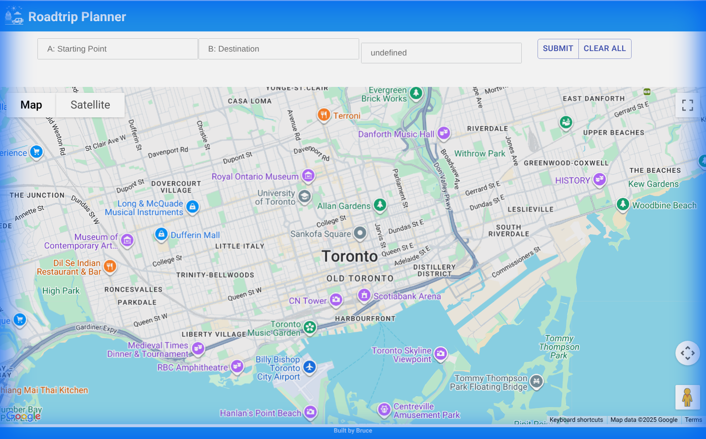
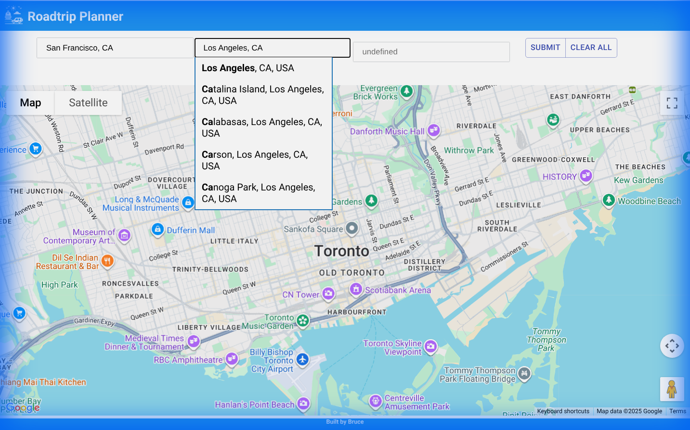

# Roadtrip Planner

Created by Bruce Chang  
Version: MVP #1

## Release Notes
This version is the initial release of Roadtrip Planner, enabling users to:
1. Search attractions between two destinations
2. Use local storage to remember map and places

**Demo Link:** [https://master.d22ka3sgyhdlrt.amplifyapp.com/](https://master.d22ka3sgyhdlrt.amplifyapp.com/)

---

# Deployment & Usage Guide

## Prerequisites
- [Docker](https://docs.docker.com/get-docker/) installed on your machine.
- A **Google Cloud Project** with billing enabled.
- A valid **Google Maps API Key**.

## Google Cloud Setup
To run this application successfully, you must enable the following Google Cloud APIs for your project:

1.  **Maps JavaScript API**: Renders the map interface.
2.  **Directions API**: Calculates routes between waypoints.
3.  **Places API**: Enables location search and autocomplete.
4.  **Geocoding API**: Converts storage addresses to coordinates (if applicable).

**Configuration Steps:**
1.  Go to the [Google Cloud Console](https://console.cloud.google.com/).
2.  Create a new project or select an existing one.
3.  Navigate to **APIs & Services > Library**.
4.  Search for and **ENABLE** each of the APIs listed above.
5.  Go to **APIs & Services > Credentials** and create an **API Key**.
6.  (Recommended) Restrict your API key to the specific APIs above to prevent unauthorized quota usage.

## Installation

### 1. Clone the Repository
```bash
git clone https://github.com/bdchang403/Roadtrip.git
cd Roadtrip
```

### 2. Configure Environment
Create a `.env` file in the root directory:
```bash
touch .env
```
Add your Google API Key to the file:
```env
REACT_APP_GOOGLE_API_KEY=your_actual_api_key_here
```

## Deployment with Docker

### Build the Image
To build the Docker image, pass your API key as a build argument:
```bash
docker build --build-arg REACT_APP_GOOGLE_API_KEY=your_actual_api_key_here -t roadtrip-app .
```
*Note: If you have a `.env` file, you can also source it or use a script to inject the variable.*

### Run the Container
Run the container mapping port 3000 to the container's port 80:
```bash
docker run -d -p 3000:80 roadtrip-app
```

Access the application at [http://localhost:3000](http://localhost:3000).

## Usage Scenarios

### 1. Home Page Dashboard
Upon loading the application, you will be presented with the main dashboard. The map is centered, and the search inputs are ready.



### 2. Planning a Route
To plan a trip:
1.  Enter a **Starting Point** (e.g., "San Francisco, CA").
2.  Enter a **Destination** (e.g., "Los Angeles, CA").
3.  *Autocomplete suggestions from the Places API will assist you.*
4.  Click the **Submit** button.

The application will calculate the optimal driving route and display it on the map.


